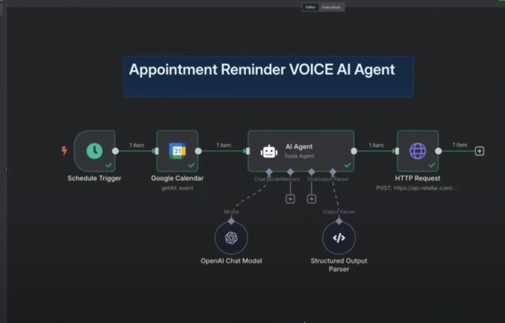

# Appointment Reminder Voice AI Agent

An automated workflow that monitors your Google Calendar and sends intelligent voice reminders for upcoming appointments.

## 🔄 Workflow Overview

This automation consists of four main components that work together to deliver personalized voice appointment reminders:

### 1. **Schedule Trigger**
- Runs on a predefined schedule (hourly/daily)
- Initiates the reminder check process

### 2. **Google Calendar Integration**
- Connects to your Google Calendar
- Retrieves upcoming events and appointments
- Filters for relevant appointments needing reminders

### 3. **AI Agent Processing**
- **OpenAI Chat Model**: Analyzes appointment details and generates personalized reminder messages
- **Structured Output Parser**: Formats the AI response into the required structure for voice synthesis
- Creates context-aware, natural-sounding reminder content

### 4. **Voice Delivery**
- Sends HTTP POST request to Retel AI voice service
- Converts the AI-generated text into natural speech
- Delivers voice reminders via phone call or voice message

## ✨ Features

- **Automated Scheduling**: Set-and-forget reminder system
- **Smart Content Generation**: AI creates personalized reminder messages
- **Voice Delivery**: Natural-sounding voice calls/messages
- **Calendar Integration**: Seamlessly works with Google Calendar
- **Structured Processing**: Reliable data formatting and delivery

## 🚀 Use Cases

- Medical appointment reminders
- Business meeting notifications
- Personal appointment alerts
- Client consultation reminders
- Service appointment confirmations

## 🛠️ Setup Requirements

- Google Calendar API access
- OpenAI API key
- Retel AI account and API credentials
- Workflow automation platform (n8n, Zapier, etc.)

## 📋 Configuration

1. Set up schedule trigger frequency
2. Connect Google Calendar account
3. Configure OpenAI model settings
4. Set up Retel AI voice service credentials
5. Test the workflow with sample appointments

---

*This automation helps ensure important appointments are never missed by delivering timely, personalized voice reminders.*
